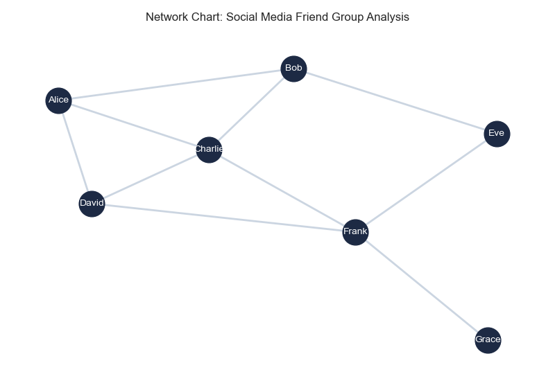

# Data_Visualizations
Data_Visualizations Examples


[Notebook Link](https://github.com/Kurodataio/Data_Visualizations/blob/main/data_visualizations.ipynb)  

---

## Table of Contents

- [Overview](#overview)  
- [Dataset](#dataset)  
- [Technologies Used](#technologies-used)  
- [Installation](#installation)  
- [Usage](#usage)  
- [Visualizations](#visualizations)  
- [Credits](#credits)  
- [License](#license)  

---

## Overview

- This visualization project was based on the Datacamp Visualizations cheatsheet
- There are 26 visualisation types grouped into 6 catagories

---

## Dataset

- The datasets are synthetically generated for the visualizations

---

<h2>Technologies Used</h2>

<ul>
  <li><strong>Languages & Libraries:</strong> Python, Pandas, NumPy, SQL, Matplotlib, Seaborn, Wordcloud, Scipy, Squarify, Networkx, Plotly</li>
  <li><strong>Tools:</strong> Jupyter Notebook, VS Code, Git, GitHub</li>
</ul>

<p>
  
  
  
  
  
  
  
  
  
  

</p>

---

## Installation

Step-by-step instructions to set up the project locally:

```bash

# Clone the repository
git clone https://github.com/Kurodataio/Data_Visualizations.git

# Navigate to the project folder
cd Data_Visualizations

# Launch Jupyter Notebook
jupyter notebook


```

## Usage

Instructions for using the project:

1. Open the main notebook (`data_visualizations.ipynb`)  
2. Run each cell sequentially to reproduce the analysis  
3. Visualizations and results will be generated automatically  

  

---

## Visualizations 
### Capture a trend
- Line Chart: Captures a numeric variable over time using straight line between points
- Multi-line Chart
- Area Chart
- Stacked Area Chart
- Spline Chart

### Part to Whole Charts
- Pie chart
- Donut pie chart
- Heat maps
- Stacked column chart
- Treemap charts

### Visualize a Single Value
- Card Component
- Table Chart
- Gauge Chart

### Capture distributions
- Histogram
- Box plot
- Violin plot
- Density plot

### Visualize relationships
- Bar Chart
- Column Chart
- Scatter plot
- Connected scatter plot
- Bubble chart
- Wired cloud chart

### Visualize a flow
- Sankey chart
- Chord chart
- Network chart


---

## Credits

<!-- - **Tutorials / References:** [Link](https://link.com)   -->
- **DataCamp Visualization Cheat sheet:**  [Link](https://www.datacamp.com/cheat-sheet/data-viz-cheat-sheet)  

---

## License

This project is licensed under the [MIT License](https://choosealicense.com/licenses/mit/)

